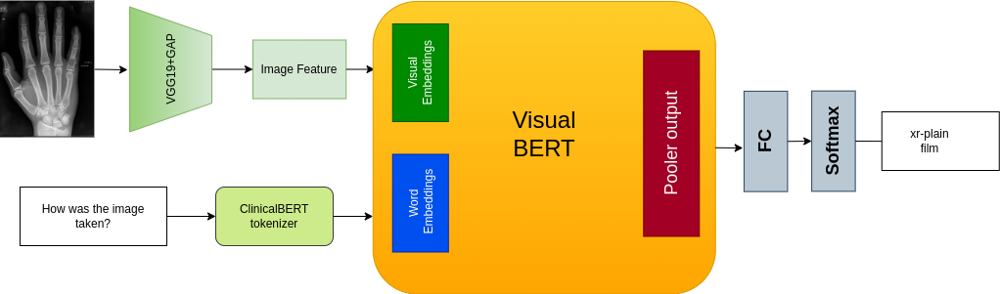
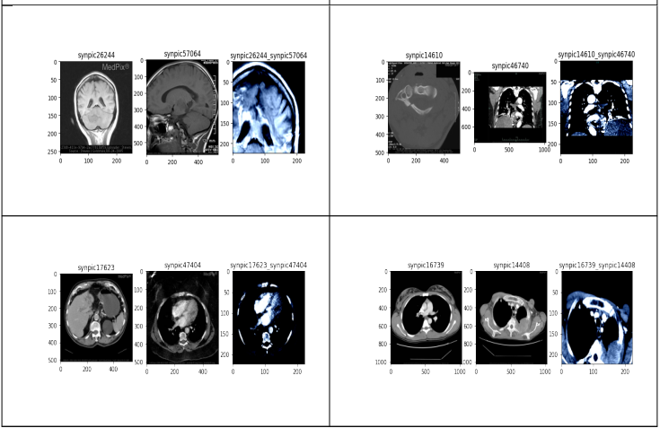
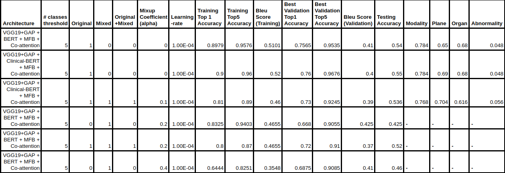
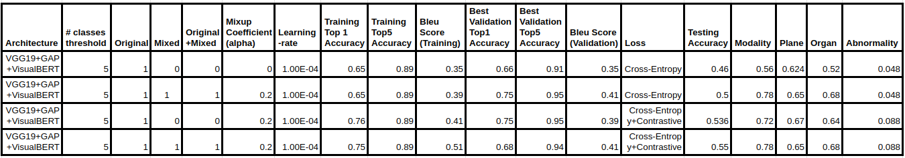

<!-- ## Visual Question Answering in Medical Domain.

1. Run preprocess_data.ipynb to preprocess data which will save the images and questions in pickle format if already not present.
2. Execute extract_features.ipynb to save image features in secondory memory which can use in training later to make it faster.
3. Execute mixup.ipynb to generate mixed images and mixed dataset along with original which will store in secondory memory.
4. Execute mixed_exp.ipynb to train the model on original+mixed dataset and also for testing.
5.  -->

<h2><a href="MTP Report.pdf">Deep Learning-based Approaches for Medical Visual Question Answering using Transformer and Mixup</a></h2>
    
[Anurag Jaiswal](https://github.com/arunava5764),        [Dr. Deepti R. Bathula](https://www.iitrpr.ac.in/deepti-r-bathula)
    
[Indian Institute of Technology Ropar,Punjab](https://www.iitrpr.ac.in/)

We implement the visualBERT architecture with a data augmentation technique on the ImageCLEF 2019 dataset and a subset of 2020. We also implement the MFB with co-attention-based architecture along with a mixup technique as a baseline to compare with the visualBERT-based Model. Both models are trained on the original dataset, mixed dataset, and original+mixed dataset. 
We also used Contrastive Loss as an additional loss along with cross-entropy Loss which improves the test accuracy for the VisualBERT-based Model. The basic aim of Med_VQA is to provide help to medical doctors and practitioners to take decisions related to medical images such as MRI, Xray-scans which can benefit society.

  
Table of Contents

  <ol>
    <li><a href="#File-Description">File Description</a></li>
    <li><a href="#Dataset Description">Datasets</a></li>
    <li><a href="#Mixed Image Examples">Mixed Image Examples</a></li>
    <li><a href="#Steps-to-Reproduce Results">Steps to Reproduce Results</a></li>
    <li><a href="#Training-and-Validation">Training and Validation</a></li>
    <li><a href="#Experimental Result">Experimental Results</a></li>
    <li><a href="#Comparison between MFB with Co-attention base architecture & VisualBERT base model with Mixup">Comparison between MFB with Co-attention base architecture & VisualBERT base model with Mixup</a></li>
    <li><a href="#acknowledgement">Acknowledgement</a></li>
  </ol>

## File Description

The content of each folder of this repository is described as follows.
- [x] **pre_processes_data.ipynb** This file contains the code for preprocessing the data and save them in pickle format.
- [x] **train_dataset_pickle** This folder contains the train data and train image feature in pickle format. 
- [x] **test_dataset_pickle** This folder contains the test images dataframe and test image features in pickle format.
- [x] **valid_dataset_pickle** This folder contains the validation images dataframe and valid image features in pickle format.
- [x] **data** This folder contains the ImageCLEF dataset.
- [x] **imgs** This folder contains all the images such as architecture image, loss and accuracy images for each experiments.
- [x] **extract_featues.ipynb** This notebook is used to extract features from images and save it in pickle format. 
- [x] **mixup.ipynb** This notebook will generate the mixed data and also prepare original_mixed data.
- [x] **mixed_exp.py** This script is used for train the model and also test on test data. To save output in file use `nohup python mixed_exp.py &` command.
- [x] **mfb_trainexp.py** This script is used for train the model and also test on test data. To save output in file use `nohup python mfb_trainexp.py &` command.
- [x] **Med_VQA** This folder contains other exeriments related to MFB with co-attention on original,mixed and original_mixed dataset.

## Datasets

we used ImageCLEF 2019 dataset and subset of 2020 dataset. The dataset should reside in data folder.

## Mixed Image Examples

## Metric for Mixup
Given a new image V and corresponding questions $Q_x$ and $Q_y$, a VQA model (M) generates predictions $P_x$ and $P_y$ for $Q_x$ and $Q_y$, respectively. The number of classes is large. We evaluate top1 and top5 accuracy. We also mixed the predictions based on mixing parameter $(\lambda)$ for top1,top5 accuracy, and bleu score. 

$V_{mix} = {\lambda}V_x + (1-\lambda)V_y$  
$A_{mix} = {\lambda}A_x + (1-\lambda)A_y$  

Predictions:  { $P_x = M(V_x,A_x) , P_y = M(V_y,A_y)$ }

MixupLoss:  { $Loss_{mix} = \lambda\mathcal{L}(P_x,A_x)+(1-\lambda)\mathcal{L}(P_y,A_y)$}

Top1 Accuracy: { $top1Acc_{mix} = \lambda Correct(P_x,A_x) + (1-\lambda)Correct(P_y,A_y)$}

Top5 Accuracy: { $top5Acc_{mix} = \lambda Correct(P_x,A_x) + (1-\lambda) Correct(P_y,A_y)$}

Bleu Score: { $bleu_{mix} = \lambda bleu(P_x,A_x) + (1-\lambda) bleu(P_y,A_y) $}
    

## Steps to Reprodue the Results

To reproduce the results please follow the steps vlbelow.

- Download the `ImageCLEF datasest` from the ImageCLEF site if not present in data folder.
- Run `preprocess_data.ipynb` to preprocess data and save the data in pickle format save in train_dataset_pickle folder.
- Run `mixup.ipynb` to generate mixed images and save them in train_dataset_pickle format.
- Run `extract_features.ipynb` to extract features from images and save them in secondory memory which later use in training to make it faster.
- Run `mixed_exp.py` for training and testing.

## Training and Validation

We have prepared pickle file for training on original data,mixed data and original+mixed data.By providing the path of pickle data in `mixed_exp.py` file.
Similary for training on mfb base architecture provide path of pickle format and execute the `mfb_trainexp.py`.

<!-- 

 -->

## Experimental Result

Experiments are conducuted on both MFB with co-attention base architecture and visualBERT base architecture on original,mixed and original+mixed dataset.

## Comparison between MFB with Co-attention base architecture & VisualBERT base model with Mixup

With the help of Mixup technique the VisualBERT model performes better on test data. Also use the contrastive loss as an additional loss with crossEntropy loss improved the accuracy further on test set.

## Acknowledgement

I would like to thank my guide [Dr. Deepti R. Bathula](https://www.iitrpr.ac.in/deepti-r-bathula) (Associate Professor, Indian Institute
of Technology, Ropar) for her continuous support and motivation throughout my project. I
would also like to thank [Mr. Abhishek Singh Sambyal](https://abhisheksambyal.github.io/) (PhD Student, Computer Science and
Engineering Department, IIT Ropar) for his guidance.

(<a href="#top">back to top</a>)

